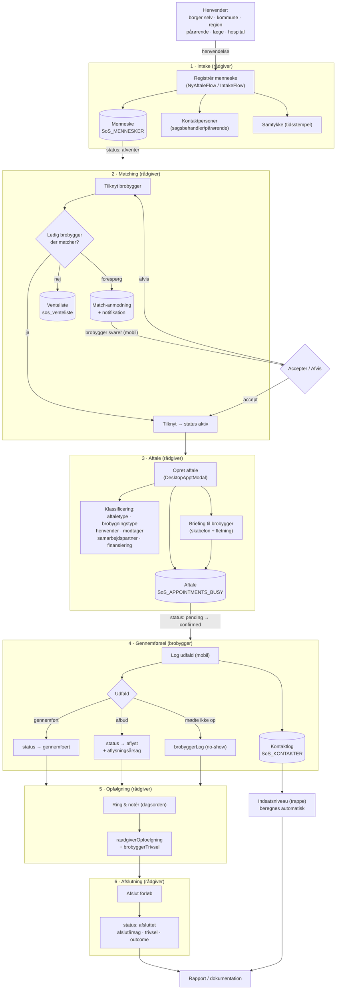
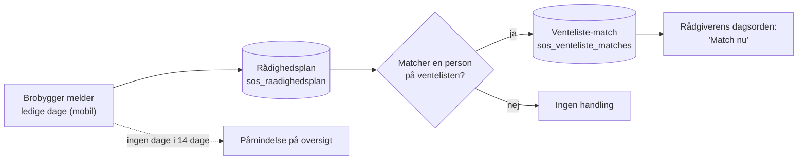
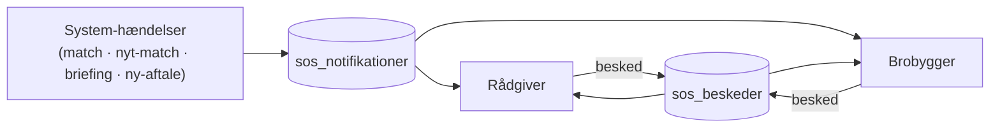
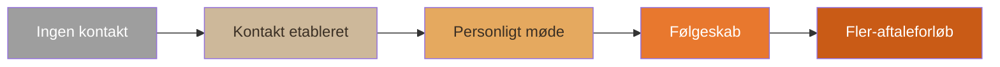
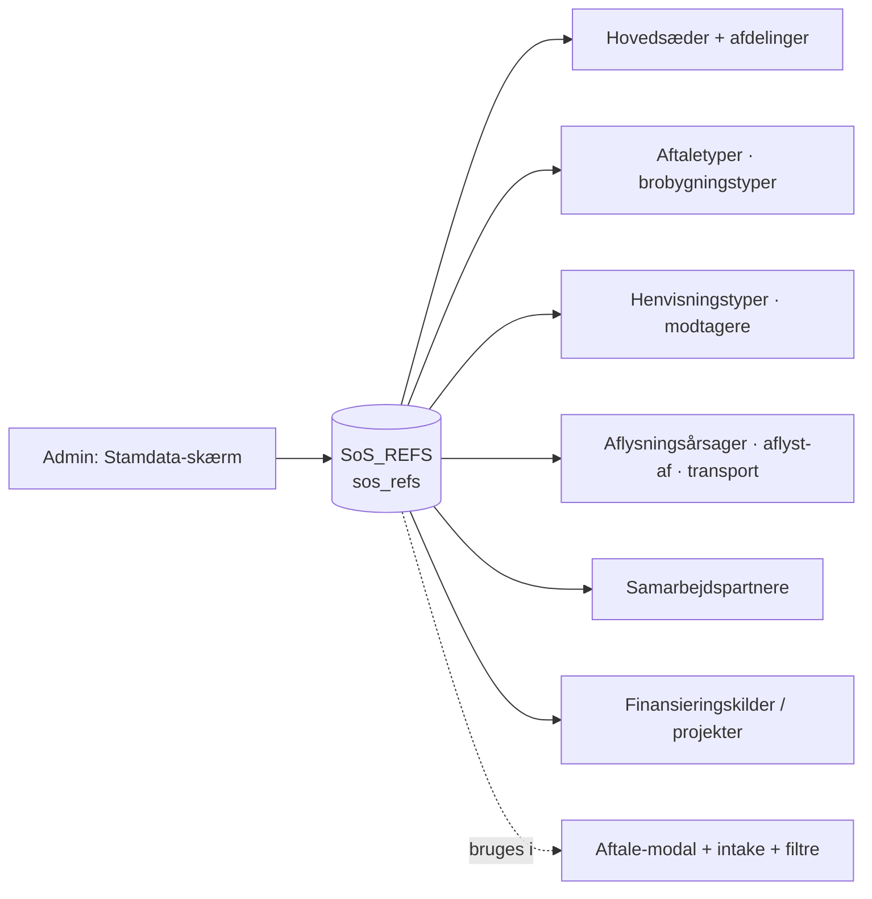

# Flows & data — Brobygger Portal

> **Levende dokument.** Opdatér når et flow eller et datafelt ændrer sig.
> Mermaid-diagrammerne renderes automatisk på GitHub.
> Sidst opdateret: juni 2026.

Dette kort viser **hvilke flows der findes i appen** (pr. rolle) og **hvilken data hvert trin genererer** — hele vejen fra en henvendelse til det rapportgrundlag systemet producerer.

---

## 1. Hovedflow — borgerens rejse (med data)

---

## 2. Rådighed & venteliste-loop (brobygger ↔ rådgiver)

---

## 3. Beskeder & notifikationer

---

## 4. Trappe-model (indsatsniveau) — hvor langt er mennesket nået

Beregnes automatisk af `calcMenneskeStats` ud fra `SoS_KONTAKTER`. Stiger mod orange = jeres mål (gennemførte brobygninger). Tidlige trin er også fremskridt — nuancen "kontakt er en succes" lever i analyser, ikke i blødere labels.

---

## 5. Data systemet genererer

| Hændelse | Data / entitet | localStorage-nøgle |
|---|---|---|
| Registrér menneske | Menneske + kontaktpersoner + samtykke | `sos_mennesker` |
| Tilknyt/forespørg brobygger | brobyggerId / matchAnmodning | `sos_mennesker`, `sos_notifikationer` |
| Sæt på venteliste | venteliste-post | `sos_venteliste` |
| Brobygger melder rådighed | ledige datoer | `sos_raadighedsplan` |
| Venteliste-match opstår | match-notifikation til rådgiver | `sos_venteliste_matches` |
| Opret/redigér aftale | Aftale + klassificering + briefing | `sos_appointments` |
| Log udfald | brobyggerLog + status + kontaktlog | `sos_appointments`, `sos_kontakter` |
| Opfølgning | raadgiverOpfoelgning + trivsel | `sos_appointments` |
| Afslut forløb | afslutårsag + trivsel + outcome | `sos_mennesker` |
| Beskeder | tovejs-tråde | `sos_beskeder` |
| Opkald-log | hurtige notater | `sos_opkald_log` |
| Stamdata (admin) | referencelister | `sos_refs` |

---

## 6. Stamdata (admin) — driver alle dropdowns

---

## 7. Rapport-output (det vi trækker ud)

Aggregeres fra ovenstående — aldrig per-borger følsomme data i eksport:

- **Aktivitet:** aftaletype-fordeling, gennemførte vs. aflyste
- **Kapacitet:** aflysningsrate + top-årsager (fx "manglende brobygger")
- **Geografi:** per hovedsæde / afdeling
- **Samarbejde:** henvender / modtager / samarbejdspartner
- **Finansiering:** per finansieringskilde / projekt
- **Effekt:** trappe-fordeling (`byNiveau`), trivsel-udvikling, SROI-snapshot

---

## Skala & ydelse (designkrav)

Systemet skal kunne håndtere **+5.000 aftaler/år · +500 brobyggere · +50 medarbejdere** (akkumuleret over år → titusinder af aftaler).

| Lag | Konsekvens |
|---|---|
| **Prototype** | In-memory filtrering er fint. Reelle grænser: lister der renderer ALLE rækker (mennesker/brobyggere/kalender) hakker ved tusinder → kræver paginering/virtualisering. localStorage (~5–10 MB) rækker ikke til års-data. |
| **Scoping** | Rådgiver → eget hovedsæde/afdeling reducerer rendered rækker markant — også en ydelsesfordel, ikke kun UX. |
| **Produktion** | PostgreSQL m. indekser · server-side paginering + filtrering (scoping = WHERE-clauses) · rapporter/SROI som aggregerede queries, aldrig client-side load af alle rækker. |

> Passer allerede: normalisering, struktureret-først, scoping, aggregeret rapportering. Største åbne prototype-risiko: **listerne mangler paginering/virtualisering.**

## Sådan holdes kortet ajour
Når et flow eller felt ændres: opdatér det relevante diagram + tabel her i samme commit som kodeændringen. Diagrammerne er ren tekst (Mermaid), så de er nemme at rette.
